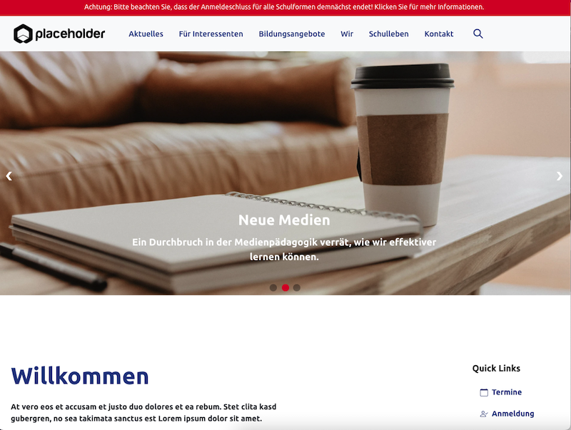
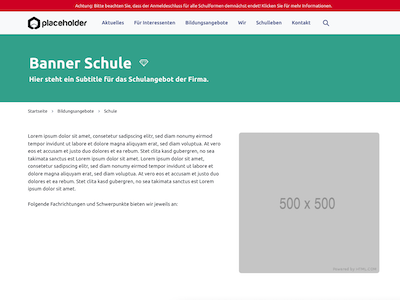
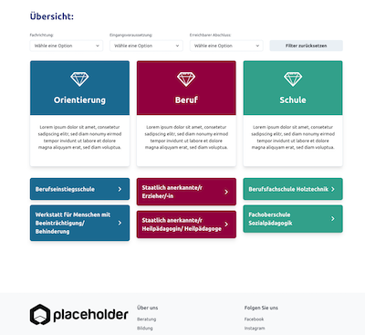

# Corporate Website - Built with Gatsby, ChakraUI, GraphQL and Strapi CMS

My first GatsbyJS corporate website project from the field of "education". The website was developed based on Gatsby, GraphQL and Chakra UI and is connected to a Strapi CMS. The repository for the Strapi CMS is "private" at the moment and will be renewed. Actually there are still open task and remaining features i want to implement in that project:
- Searchbar functionality
- Connection to a Database (for school sign-up etc.)
- optimizing of folder/pages and variable naming
- setup new/updated strapi cms with more meaningful collection/content types  
- refactoring larger code sections in smaller components (where necessary).

## Preview of the landingpage

## Preview a content stage & a filter component

## Sources for icons/logos in that project:

[Placeholder Logos](https://placeholder.com/)

<a target="_blank" href="https://icons8.com/icon/YFn1QHQKdou6/ecommerce">Ecommerce</a> icon by <a target="_blank" href="https://icons8.com">Icons8</a>

<a href="https://www.flaticon.com/free-icons/info" title="info icons">Info icons created by Freepik - Flaticon</a>
